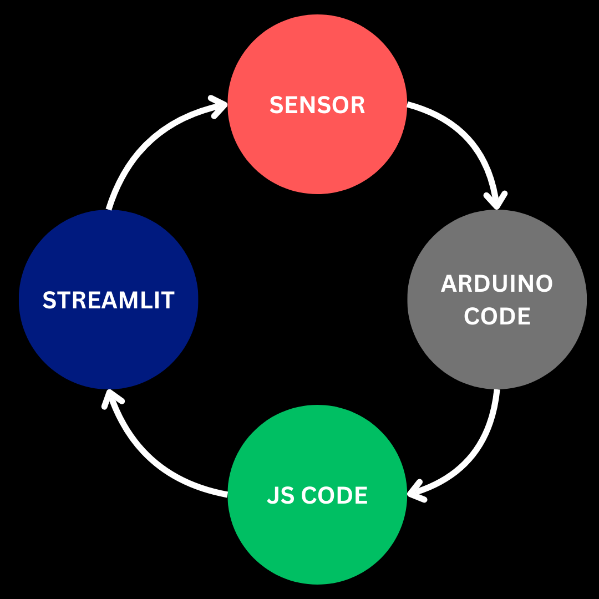

# Fingerprint-Attendence-System
## Introduction
We, the members of RIG have to follow WorkHour requirements to ensure steady-working of our club activities and finishing our projects.This is an initiative taken by B21-B22 Batch of RIG in making an easily accessible and maintainable way of ensuring that the Work-Hours requirements are met.You may use this repo to make necessary changes and making the system more robust and fool-proof as you see fit.
If you are connected to NITC wifi ,You can view the Streamlit app [here.](http://fp.local:8501/) 
## Tools Used
| Hardware                | Software          |
|-------------------------|-------------------|
| R307 Fingerprint Sensor | Maria DB          |
| Rasberry Pi 3B          | Arduino Code      |
| PowerBank               | JavaScript Code   |
| RTC Module              | Streamlit         |
| ESP32                   | Firebase          |
## Overview
<div class = Overview style="display:flex">

  <p style="padding-left:14px" >
    The Sensor once it recieves a signal will send the ID and the time by serial communication as per Arduino Code.This communication will be recieved by the Javascript code and will be alotted to the in-time column and to out-time column if the in-time column is preoccupied.The data gets committed into database realtime and is acceessed by streamlit which manipulates and displays the data.The database commands are handled by javascript code and the backend needed for displaying is handled using streamlit and numpy .
  </p>
</div>

## Team Members

| Name                | Batch | Role                                       |
| ------------------- |:-----:|:------------------------------------------ |
| Shibin Fazil        | B21   | Project Lead and Arduino Programmer        |
| Krishnachandran     | B22   | Backend Developer and Database Admin       |
| Mohammed Rashith KP | B22   | Frontend Python Developer(Streamlit)       |
| Jerin Shaji         | B22   | Face Detection Developer                   |
| Prajul Snehajan     | B22   | Electrical Engineer                        |

## Guide
### How to Enroll New Members

1.Add Details of Members to the Excel sheet and run the copy_2_database.js

2.Run [LCD_ENROLL_TEST.ino](</Arduino Code/LCD_ENROLL_TEST/LCD_ENROLL_TEST.ino>)

3.Enter your ID

4.Place finger on sensor

5.Remove  and Place  finger once more in the sensor

6.Wait for the ID stored with confidence message either in LCD screen /Serial Monitor in Arduino IDE to confirm that the process has been completed successfully  
>Confidence of 200+ is considered good for practical use.

>If you encounter COM Error, Detach and Reattach the Fingerprint-Sensor from Breadboard and press the boot switch in esp32.

7.Edit the [Finger_Print_Completed.ino](</Arduino Code/Finger_print_Completed/Finger_print_Completed.ino>) adding all the names in the string seperated by the comma with the index same as ID

---
### How to Setup a workspace in Raspberry Pi-3B from scratch

1.Install micro code editor 
```bash
sudo apt install micro
```

2.[Setup a python venv](https://learn.adafruit.com/python-virtual-environment-usage-on-raspberry-pi/basic-venv-usage)

3.Clone this repository

4.Open a terminal inside the repository and run 
```bash
pip3 install -r requirements.txt
```

>After adding some package to existing ones,always run 
```bash 
pip3 freeze > requirements.txt
```


5.Setup [Maria DB](https://raspberrytips.com/install-mariadb-raspberry-pi/)

6.Open a terminal and run `sudo micro ~/.bashrc` and copy the code after the last lines in bashrc to make the code run in the background whenever the pi is powered on.
```bash
source env/bin/activate
node server30.js
streamlit run 
```

## Reference

[Streamlit Video Tutorial](https://youtu.be/7yAw1nPareM?feature=shared)

[Streamlit Authenticator Docs](https://blog.streamlit.io/streamlit-authenticator-part-1-adding-an-authentication-component-to-your-app/)


